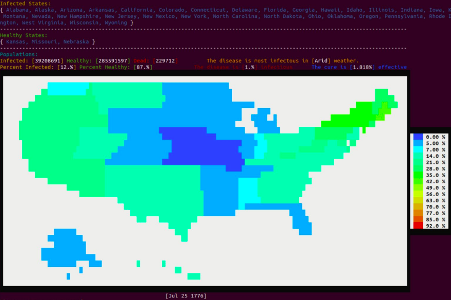

- Similar to the Plague, Inc. game; uses basic epidemic theory to replicate the spread of disease throughout the United States. Written in the functional language OCaml. More information on design can be found [here](https://cgyurgyik.github.io/documents/CamlPox.pdf), an overview of the second sprint.

## To Play:
Required packages:
- [unix](https://caml.inria.fr/pub/docs/manual-ocaml/libref/Unix.html)
- [yojson](https://opam.ocaml.org/packages/yojson/)
- [oUnit](https://github.com/gildor478/ounit)
- [ANSITerminal](http://ansiterminal.forge.ocamlcore.org/ANSITerminal.html/ANSITerminal.html)
Since a Makefile is provided, just run:
```make play```



## Features
- Portrays a realistic map of the United States with an underlying matrix that represents connections between each states, to include transcontinental flight connections.
- Allows user to select from different upgrades and items to enhance the Spread, Virulency, and Death rates.
- Climate has been added to provided another dimension of crisis. 
- Players are challenged to maintain a high spread rate while not immediately killing everyone in the local area, since this will end the virus before everybody dies. Three different levels of difficulty are provided: Benign, Dangerous, and Deadly.
- Accurate population counts of each state are provided, with further statistics on the number of dead, sick, and healthy individuals.

* Written in two weeks for Cornell University's _CS 3110, Functional Programming in OCaml_.

## Authors
- Chris Gyurgyik
- Bobby Ma
- Joseph Sauto
